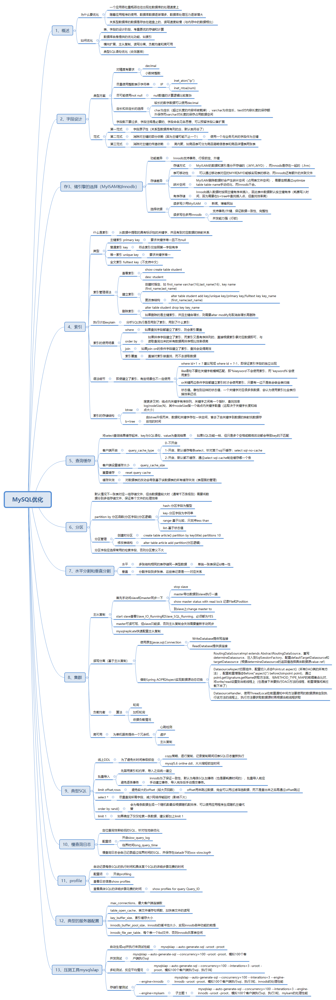

# 本文概要

# 概述
## 为什么要优化
* 系统的吞吐量瓶颈往往出现在数据库的访问速度上
* 随着应用程序的运行，数据库的中的数据会越来越多，处理时间会相应变慢
* 数据是存放在磁盘上的，读写速度无法和内存相比
## 如何优化
* 设计数据库时：数据库表、字段的设计，存储引擎
* 利用好MySQL自身提供的功能，如索引等
* 横向扩展：MySQL集群，负载均衡，读写分离
* SQL语句的优化（收效甚微）
## 字段设计
> 字段类型的选择，设计规范，范式，常见设计案列
### 原则：尽量使用整型表示字符串
#### 存储IP
INET_ATON(str) ,address to number
INET_NTOA(number) ,number to address
#### MySQL内部的枚举类型（单选）和集合（多选）类型
但是因为维护成本较高因此不常使用，使用**关联表**
